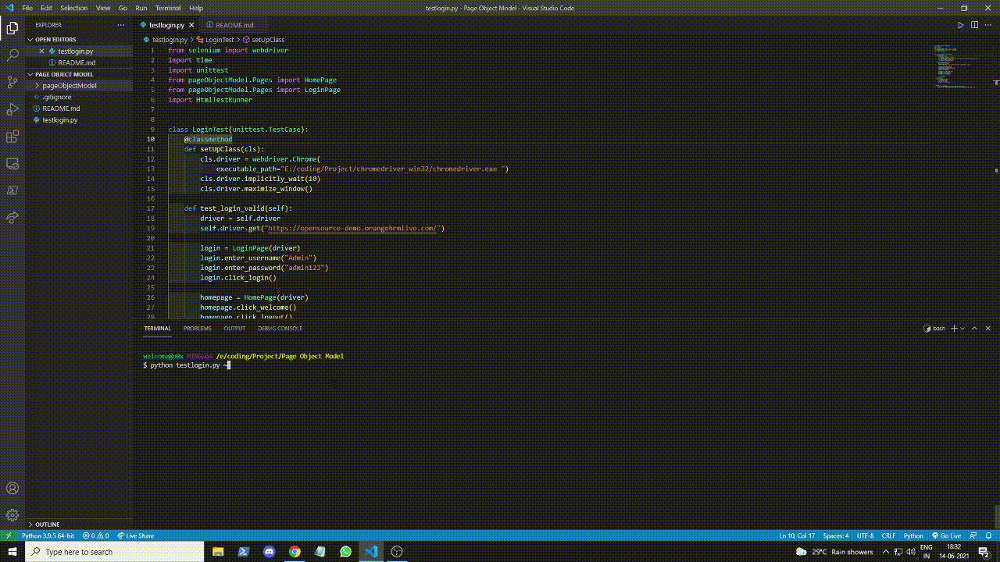

    <h1>Page Object Model (POM)</h1>

This is the simple project which I made while learning about selenium and unit testing .

### Things I have Implemented in this project.

- Created a simple login test
- Implemented unit testing
- Implented Page Object Model
- Separated the test scripts and objects
- Create a separate class for Locators
- Added HTML Reports... (Using HTML testrunner)

### Demo

## 

For the testing purpose I have used [this](https://opensource-demo.orangehrmlive.com/) website which is an open source project.
